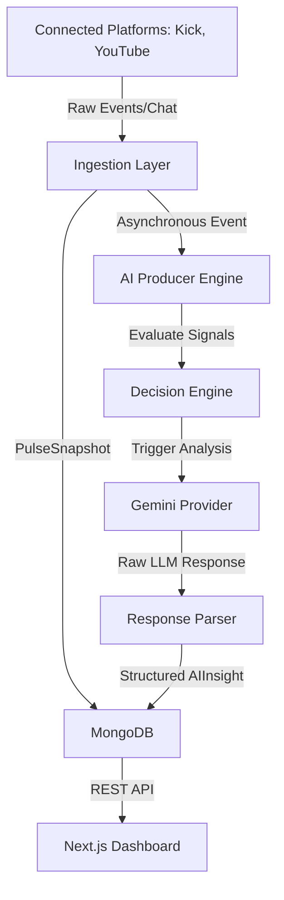

# NexCreator Engineering Bible (v2)

A living, definitive engineering specification and project context for **NexCreator**—the premium AI Creator Manager and Real-time Stream Analytics/Coaching platform.

---

## Volume 1 — Vision & Product

### 1.1 Product Vision
NexCreator is a next-generation, real-time AI-powered companion and performance manager for content creators and live-streamers (Kick, YouTube, Twitch). Unlike traditional analytics tools that display post-hoc charts and tables, NexCreator ingests active live-stream data (telemetry, viewer velocity, chat sentiment) in real-time. It acts as an autonomous AI Producer that offers in-stream coaching, identifies key engagement opportunities, detects retention drops, and generates highly tailored publishing and growth strategies.
* **Core Philosophy**: Enable creators to focus 100% on their performance while the AI manages retention mechanics, chat engagement, community memory, and highlight extraction.

### 1.2 Personas
* **The High-Growth Streamer (e.g., Ansh)**:
  * *Needs*: Real-time alerts when chat velocity spikes, quick identification of high-value community interactions (Hype Moments), stream pacing feedback.
  * *Pain Points*: Overwhelmed by reading rapid-fire chat while trying to play games or entertain; struggles to find optimal highlight clips.
* **The Tactical Creator Manager**:
  * *Needs*: Aggregated post-stream performance scores, truth-certified growth analytics, structured action items, and actionable content playbooks.
  * *Pain Points*: Fragmented metrics across platforms; lack of qualitative, context-aware coaching pointers.

### 1.3 Feature Hierarchy
* **Live Session Monitoring**: Platform-agnostic connectors that stream chat, viewer counts, and status events.
* **AI Producer & Decision Engine**: Evaluates live telemetry and uses lightweight criteria to determine when to trigger LLM analysis without violating API budgets.
* **Evidence Intelligence Pipeline**: Real-time extraction of raw evidence, claims validation, moment/act detection, and truth-certified highlights.
* **Dashboard & Live Overlay**: High-fidelity, real-time visual interface with stream health indicators, AI notes, action items, and a workspace roadmap.

### 1.4 Monetization
* **Free Tier**: Local execution, basic stream metrics, standard dashboard views, and rate-limited AI summaries.
* **Creator Pro**: Live AI producer coaching overlays, automated highlight detection, advanced evidence graph generation, and continuous memory persistence.
* **Enterprise / Agency**: Multi-creator management consoles, white-label analytics interfaces, and custom model deployments.

### 1.5 Competitive Analysis
* *Traditional Analytics (Streamlabs/Streamelements)*: Focuses purely on raw quantitative overlays and alerts (e.g., subscriber notifications). Fails to provide qualitative feedback or extract audience behavioral patterns.
* *Video Editing Tools*: Extract highlights after the stream is over, requiring manual scrubbing. NexCreator extracts highlights automatically in real-time based on viewer sentiment spikes.

---

## Volume 2 — System Architecture

### 2.1 Overall Architecture
NexCreator is designed as a decoupled, asynchronous, event-driven web application:
* **Frontend**: Next.js App Router (React, Tailwind CSS, Framer Motion, Lucide Icons).
* **Database**: MongoDB (stores raw snapshots, event history, session intelligence, and AI insights).
* **AI Engine**: Decoupled AI Producer layer integrated with Google Gemini (REST-based providers, config-driven model selection).



### 2.2 Event-Driven Design
The core engine relies on a continuous ingestion stream:
1. Platforms push events into the collector layer.
2. Ingestion worker outputs normalized `PulseSnapshot` frames.
3. The snapshot engine persists the pulse.
4. An asynchronous boundary triggers the `AIProducer` to process the state change without blocking the main event loops.

### 2.3 Platform Adapter Layer
Platform-specific logic is isolated using adapters:
* **Base Collector Interface**: Declares startup hooks, event listeners, and cleanup handlers.
* **Kick Adapter**: Connects using custom Pusher channels and WebSocket APIs to parse chat payloads and room states.
* **YouTube Adapter**: Queries YouTube Live API streaming endpoints to parse live chat and broadcast metrics.

### 2.4 AI Pipeline
* **Token Minimization**: Filters raw data through the `PromptBuilder` to stay below 800 tokens.
* **Cache Layer**: `AICache` hashes data states to suppress duplicate analysis calls.
* **Graceful Fallbacks**: Generates rule-based deterministic responses if external AI providers are offline or rate-limited.

### 2.5 Database Design
* `sessions`: Metadata about active live streams.
* `pulse_snapshots`: Historical series of performance and engagement metrics.
* `ai_insights`: Individual analytical documents emitted by the AI Producer.
* `session_intelligence`: The single canonical document containing intelligence summaries, audience diagnostics, and coaching actions.

### 2.6 API Contracts
* `GET /api/ai/insights?sessionId=XYZ`: Retrieves raw historical insights.
* `POST /api/session/start`: Initiates stream tracking for a creator.
* `GET /api/session/intelligence?sessionId=XYZ`: Returns the fully consolidated creator DNA and session intelligence object.

---

## Volume 3 — UI/UX

### 3.1 Every Screen
* **Dashboard Overview**: Primary landing page showing greeting cards, system readiness indicators, the Workspace Status checklist, and recent AI manager notes.
* **Live Session Studio**: Real-time dashboard showing running retention charts, chat telemetry streams, and dynamic AI insight overlays.
* **Session Summary Review**: Deep-dive analytics page displaying the consolidated Session Intelligence report, highlighting major wins and coaching tips.

### 3.2 User Flows
1. **Onboarding**: Connect platform channels (Kick/YouTube) -> Establish Creator Mission -> Initialize Creator DNA.
2. **Stream Live Ingestion**: Creator clicks "Start Session" -> Connectors go active -> Real-time dashboard displays metrics -> AI Producer generates periodic insights.
3. **Post-Stream Recap**: Creator finishes stream -> Session Intelligence compiles final metrics -> Creator receives coaching checklist.

### 3.3 Design System
* **Theme**: Sleek, futuristic dark mode.
* **Colors**:
  * Backgrounds: Deep space black (`#0B0C10`), Slate (`#0f172a`), Dark Charcoal (`#13151A`).
  * Primary/Accents: Vibrant purple (`#a855f7`), Emerald Green (`#34d399`), Ice Blue (`#f8fafc`).
* **Typography**: Outfit / Inter fonts.
* **Animations**: Framer Motion transitions (staggers, slide-ups, hover scales).

### 3.4 Component Hierarchy
```
src/
└── components/
    ├── dashboard/
    │   ├── DashboardWelcome.tsx (Workspace Status, Quick Action Card)
    │   └── SessionControls.tsx
    ├── live/
    │   ├── TelemetryGrid.tsx
    │   └── InsightStream.tsx
    └── shared/
        └── ShieldStatus.tsx
```

---

## Volume 4 — AI

### 4.1 Prompt Library
System prompts are version-controlled in the repository (`src/lib/ai/promptBuilder.ts`). They enforce:
* Structured JSON outputs without Markdown wraps (when possible, or parsed safely).
* Focus on qualitative advice: Pacing adjustments, audience dynamic detection, and specific retention strategies.

### 4.2 Analysis Pipeline
The analysis pipeline acts as an assembly line:
```
PulseSnapshot -> DecisionEngine (Rate check) -> Cache Check -> PromptBuilder -> LLM Provider -> Parser -> Validation -> DB Insertion
```

### 4.3 Timeline Generation
Builds structured stream event logs mapping temporal timestamps to significant happenings:
* Audience spikes (Spam spikes, viewer surges).
* Substantial drops (lulls, content disconnects).
* Hype moments detected by chat velocity and sentiment.

### 4.4 Creator Coaching
Extracts actionable instructions matching the Creator's Mission.
* Emits specific coaching items with concrete, quantitative goals (e.g., "Address chat questions within 2 minutes during high-hype moments").
* Maps items directly to confidence ratings and source evidence.

### 4.5 Recommendation Engine
Recommends optimal clip-creation zones, publishing formats (Shorts/VODs), and stream titles based on peak-engagement indices captured in the session.

---

## Volume 6 — Production

### 6.1 Deployment
* **Framework**: Next.js deployable to Vercel, AWS Amplify, or a standalone Node.js container (configured in `server.js`).
* **Database**: MongoDB Atlas cloud cluster with replica sets.

### 6.2 Monitoring
* **AITelemetry**: Tracks provider response times, prompt tokens consumed, request/skip ratios, and API errors.
* **Diagnostics**: Lightweight heartbeat checkers monitor active WebSocket endpoints.

### 6.3 Logging
* Unified logging wrapper (`aiLogger.ts`) with severity settings (`info`, `warning`, `critical`).
* Separate tracking logs for upstream ingestion failures (e.g., Kick API structural changes).

### 6.4 Scaling
* **Asynchronous Offloading**: Ingesting streams uses light Event Emitters. Heavyweight calculations (like Evidence Graph building or LLM calls) are queued or executed in non-blocking background workers (`analyzerWorker.ts`).

### 6.5 Security
* Server-side environment isolation (`.env.local` containing API credentials).
* Request rate limiting (`rateLimit.ts`) and validation decorators (`validation.ts`, `authValidation.ts`).

### 6.6 Cost Optimization
* Decision Engines prevent unnecessary API calls by skipping analysis during low-activity windows.
* Token minimization techniques ensure Gemini API queries stay within the free-tier bounds (under 3 requests/hour).
